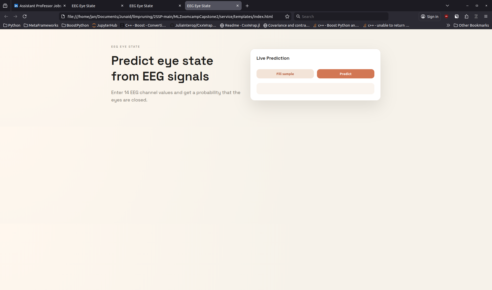

# EEG Eye State Capstone

Predict whether a subject's eyes are open or closed from EEG signals. This is a clean, end-to-end ML pipeline: EDA, training, model selection, and a Dockerized web service for inference.

## Highlights
- **Problem**: Binary classification of eye state from 14 EEG channels.
- **Value**: A lightweight model can infer eye state quickly from sensor readings.
- **Stack**: scikit-learn + Flask + Docker.

## Web Interface
Screenshot of the proposed web UI:



## Dataset
- File: `EEG-Eye-State.csv`
- Target: `eyeDetection` (0 = open, 1 = closed)
- Features: AF3, AF4, F3, F4, F7, F8, FC5, FC6, T7, T8, P7, P8, O1, O2

## Project layout
```
.
├── EEG-Eye-State.csv
├── notebooks/
│   └── eda_and_training.ipynb
├── train.py
├── models/
│   ├── model.pkl
│   └── metadata.json
├── service/
│   ├── app.py
│   └── example_request.json
├── Dockerfile
└── requirements.txt
```

## Quickstart

### 1) Train the model
```bash
python3 train.py
```
Artifacts are saved to `models/`.

### 2) Run the service locally
```bash
pip install -r requirements.txt
python3 service/app.py
```

Test it:
```bash
curl -X POST \
  -H "Content-Type: application/json" \
  -d @service/example_request.json \
  http://localhost:9696/predict
```

### 3) Run with Docker
```bash
docker build -t eeg-eye-state .
docker run -p 9696:9696 eeg-eye-state
```

## API

### `POST /predict`
Request body can be either:
- A full feature map (recommended), or
- A `features` array in the exact feature order.

Example:
```json
{
  "AF3": 4329.23,
  "AF4": 4393.85,
  "F3": 4289.23,
  "F4": 4280.51,
  "F7": 4009.23,
  "F8": 4635.90,
  "FC5": 4148.21,
  "FC6": 4211.28,
  "T7": 4350.26,
  "T8": 4238.46,
  "P7": 4586.15,
  "P8": 4222.05,
  "O1": 4096.92,
  "O2": 4641.03
}
```

Response:
```json
{
  "eye_closed_probability": 0.83,
  "prediction": 1
}
```

### `GET /health`
Returns service status.

## Modeling notes
- Baselines: Logistic Regression, Random Forest, Gradient Boosting and Neural Network.
- Model selection: ROC AUC + accuracy.
- Tuned model: Random Forest with a small grid search.

## Reproducibility
Run the notebook for EDA and visualization:
`notebooks/eda_and_training.ipynb`.
